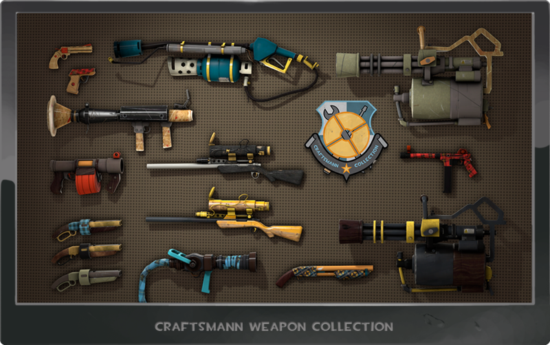
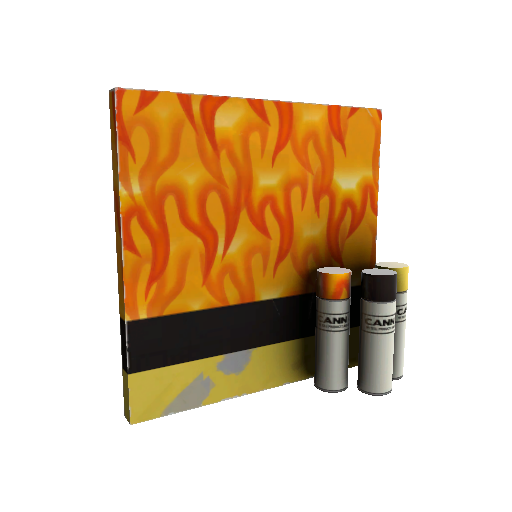
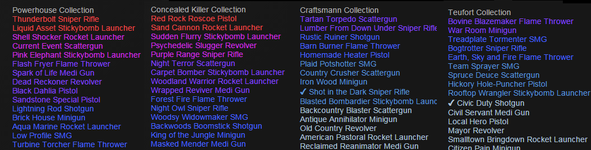
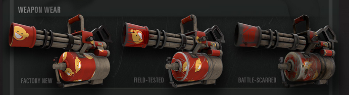
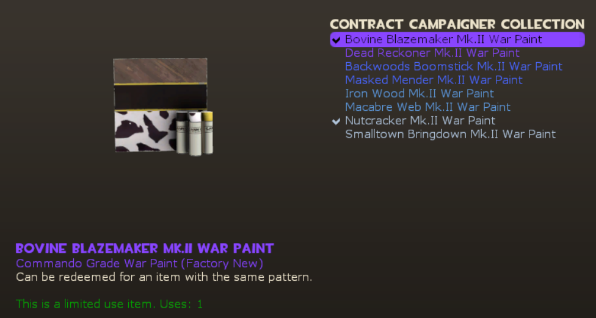
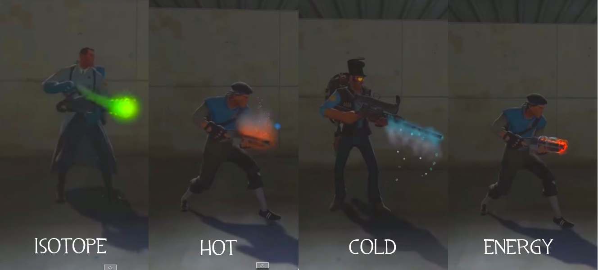

# Skin Finder
#### Video Demo:  https://youtu.be/5dia8x89NL0
#### Description:
## CS50 Final Project
This is my final project for the CS50 Introduction to Computer Science course.

## Introduction
The goal for this application is to enable users to find and search for specific virtual in-game "weapon skins" from the game Team Fortress 2.

The application will help you quickly and easily view all the diffrent weapon skins in Team Fortress 2, and check their prices.

For the purpose of my application, I use three diffrent sites for looking up the skins and their prices.
The sites I use are [steamcommunity.com](https://steamcommunity.com/), [backpack.tf](https://backpack.tf/) and [marketplace.tf](https://marketplace.tf/).  
 These are the most common sites for buying and selling in-game items in Team Fortress 2.  
These sites are utilized to find skins matching the search criteria set within the application.

## Quick Overview of Sites
### Steam
Steamcommunity, or more known as steam, is a video game digital distribution service developed by Valve. Valve is the creator of Team Fortress 2, the game from which the virtual in-game items my application is searching for comes from.  
I am specifically using [Steam community market](https://steamcommunity.com/market/search?appid=440) for the game Team Fortress 2 to look for these items.
Steam community market is a place to buy and sell in-game items with steam wallet funds. In the search example [here](https://steamcommunity.com/market/search?q=+++&category_440_Collection[0]=any&category_440_Type[0]=any&category_440_Exterior%5B%5D=tag_TFUI_InvTooltip_FactoryNew&category_440_Rarity%5B%5D=tag_Rarity_Mythical&category_440_Quality%5B%5D=tag_strange#p1_price_asc), you can see a search using the filters in green: "Team Fortress 2" for the game, "Factory New", "Commando" and "Strange".  Beneath the filters is a list of the corresponding search with all the items fitting that search, from lowest price to most expensive.

### Backpack.tf
Backpack.tf is a community-driven website and trading platform primarily focused on Team Fortress 2. It mainly serves as a hub for players to trade, list their in-game items for sale and determine the value for their in-game items.

My application is using https://backpack.tf/classifieds to look for items using search filters. In the search example [here](https://backpack.tf/classifieds?&texture_name=Cabin+Fevered&wear_tier=1%2C2%2C3%2C4%2C5&quality=11), you can see the search filters by the top of the page. Below the filters, you'll find two rows: sell orders to the left, and buy orders to the right.  
For buying skins, we mainly look at the sell orders. Each listing includes an image of the item, its name, and the listed price. Prices are typically in Team Fortress 2's in-game currency: "keys" and "ref" (refined metal).

* The value of each key on the Steam Community Market can be found [here](https://steamcommunity.com/market/listings/440/Mann%20Co.%20Supply%20Crate%20Key).
* You can check the current exchange rate of keys to ref [here](https://backpack.tf/classifieds?item=Mann+Co.+Supply+Crate+Key&quality=6&tradable=1&craftable=1&australium=-1&killstreak_tier=0).  

Some listings might also be listed in a dollar amount. This means the seller is selling the item through marketplace.tf, which is an affiliate with backpack.tf.

### Marketplace.tf
Marketplace.tf is an online marketplace for selling and buying in-game items for real-world currency, primarly focused on Team Fortress 2.

Like the other websites, I am using my application to look for items using search filters. In the search example [here](https://marketplace.tf/browse/tf2?sterm=+Cabin+Fevered+&sstrange=1&ssortfield=min_price&ssortdir=1), we are using the same search filters as the backpack.tf example. You have filters on top, and then a grid of all the items that fit that search.  
Unlike steam market and backpack.tf, marketplace lets you sell or buy items for real world currency. Steam wallet funds cannot be withdrawn, only spent trough steam.

## Quick Overview of Team Fortress 2 In-Game Items
### Skins
Skins, or [decorated](https://wiki.teamfortress.com/wiki/Decorated) are essentialy cosmetic "skins", usually applied to in game weapons. Each skin has a grade, wear level, and may include a strange counter and/or unusual effect applied to it. Decorated weapons are purely cosmetic, and have no effect on gameplay. Skins can be either a "decorated weapon" or a "warpaint".
### Decorated Weapons
Decorated weapons are skins applied to a specific weapons. For example, the [warhawk](https://wiki.teamfortress.com/wiki/Decorated#/media/File:Backpack_Warhawk_Rocket_Launcher_Factory_New.png) skin can only be on the Rocket Launcher weapon. Some decorated weapon skins are avaible on several diffrent weapons.

### Warpaints
Unlike decorated weapons, warpaints are skins that can be applied to 45 different weapons. They offer the flexibility of choosing which weapon to apply the warpaint to, creating a unique weapon with the selected warpaint pattern.

### Collections
Skins are usually obtained through cases, which require an in-game key to open. Each case represents is its own collection. Currently, there are eight decorated weapons collections and 14 war paint collections. 

Image of 4 diffrent weapon collections, with the name on the top, and underneath the name of all the decorated weapons in that collection. The color of the names is the Grade of the weapons.

### Wears
Skins come in one of five diffrent levels of exterior wear.  
These levels of wear, in order of most pristine to most worn are:
* Factory New
* Minimal Wear
* Field-Tested
* Well-Worn
* Battle-Scarred  

At the highest grade, the weapon will look brand new. For each wear level, scratches and eventually blood splatters begin to appear. The skin paint eventually becomes extremely worn and battered. at the lowest grades.  

### Grades
Skins are categorized into six diffrent rarity grades. This value is intrinsic to the specific skin and servers as an indicator of rarity.  
The list of the rarity tiers is as follows, with the most rare at the top:
* Elite
* Assasin
* Commando
* Mercenary
* Freelance
* Civilian

Image of a 'Bovine Blazemaker Mk.II' Warpaint. Underneath the name you can see in purple, that it is Commando grade and Factory New. Top right you can see the name of the Collection, and underneath all the Warpaints in that collection.

### Quality
Skins come in 3 qualities:
 * Decorated (default).
 * Strange (often indicated by an orange color, tracking in-game kills)
 * Unusual (often indicated by a purple color, featuring special particle effects)
 
 Unusual weapons are highly valuable and can vary widely in price based on other factors. Some skins can be both strange and unusual. Unusual skins come with 4 diffrent possible particle unusual effects.

Image of all four unusual weapon effects.
 

 It is possible for skins to be both strange and unusual.
 ### Killstreaks
 Killstreaks can be applied on your weapons trough a Killstreak Kit. A Killstreak Kit can be applied to a specific weapon, upgrading that weapon into a Killstreak weapon. These kits come in 3 tiers, each tier adding cosmetic effects that become more visible as your killstreak count increases.

 Tier 1: Killstreak
 * A kill counter appears in the player's HUD, tracking the number of kills made with any Killstreak weapon equipped. Resets upon death. 
 * The player's Killstreak count is displayed in the scoreboard and next to their name in the killfeed.
 * Every 5 kills, a message gets displayed to the server with the player's name and current streak.

 Tier 2: Specialized Killstreak
 * Weapon gains a colored sheen.

 Tier 3: Professional Killstreak
 * Add a colored particle effect to the user's eyes. Start at a 5-killstreak.

 Gif of a player with a Professional Killstreak. Notice the sheen on the weapon and eye effect.
 

## Explaining The Project
Skin Finder is a Flask application that is made to enable users to quickly and easily, find and search for virtual in-game «weapon skins» from the game Team Fortress 2.
### Why?
#### The Problem
* Skins in the game can sometimes be hard to search for and find, due to the many diffrent qualities they can have.  
* Figuring out what skins could be worth can be difficult. 
* There is many diffrent places to buy skins from, with the 3 sites ive listed earlier being the most widley used. 
* It can be hard to get a simple overview of all the skins that exist in the game.
#### What The Application Solves
This application makes it quick and easy to:
* Perform specific searches for skins you are looking for.
* Quickly browse trough all the skins in the game
* Compare prices using the three provided links to different websites. This helps you get a better idea of a skin's potential value, find the skins you're looking for, or discover cheap skins you can buy to resell for a profit.  
* It provides and clear grid of all the warpaints and decorated weapons in the game, and you can quickly make searches on those skins with 12 pre-made search filters.

### Usage
#### /Search
The default landing page on the site is the search form, which can also be accessed through the navigation bar. The search form allows you to make specific searches trough the sets of diffrent optonal filters.  
1. **Making a Search:**  Complete the search form with your desired filters and criteria. After submitting, you will be redirected to a result page that displays your search filters in the URL.

2. **Result Page:** On the result page, you will find:
    * **Skin Info Container:** To the left there is a info container for the skin. It includes the title of the skin, an image of the skin and its grade. The grade is highlighted with the corresponding color of the grade on the background, skin title, and container border.

    * **Site Links:**  In the right container you have three icons that opens a new tab to the three different sites, corresponding to your search. 
    * **Edit Search Filters:** Underneath the icons you have additional search filters if you need to edit the search.  
        The currently selected filters are highlighted in green. You can modify your search criteria and click "Search" to update the results.

    * **Quick Search Link:** At the bottom, there is a link to the quick search page for the current skin (if available).

#### /warpaints and /decorated_weapons
The "Warpaints" and "Decorated Weapons" pages, accessible from the navigation bar, offer an overview of all warpaints/decorated weapons in a grid format.  
The functionality is similar for both.

1. **Grid Overview:** By default the skins are sorted by grade. There are sorting buttons at the top, including options to sort by grade, collection, and for searching.

1. **Selecting a Skin:** Clicking on a specific skin redirects you to a dedicated page for that skin.
    * **Skin Info Container:** To the left, you will find the same info container for the skin, as seen on the result page.

    * **Search Filters:** To the right, there is a table of diffrent search filters. There are 12 diffrent filters, including one for any wear tier, and then options for each wear tier and the same but in "strange" variants.  
    Each table row includes three icons corresponding to the diffrent sites. Clicking these icons redirects you to the respective site with the applied search filters.

## Project Files
### Python Files
* **app.py:**
This file contains the main Flask application code, which handles routing, site functionality, and interaction with the databse. Uses many helper functions from helpers.py.

* **helpers.py:**
Includes helper functions and constants used in app.py. Functions for creating links to the 3 diffrent sites according to the selected filters submitted.
* **database_utility.py:**
This file isnt used in the application, but was used when adding all the diffrent warpaints and decorated weapons into the database. I decided to keep these functions in the project for documentation, and for usage when new warpaints or decorated weapons get added to the game.
### Templates
* **layout.html:** 
Layout includes the navbar, based on bootstrap. Layout defines a block called main, inside which all the other templates will go. This means all other templates is like an extension of loyout.html.

* **search.html:**
Includes the search form where users can make a search. Using jinja to populate the form with all the different weapons, warpaints and skins. There is some JavaScript functionality to prevent users from selecting both a decorated weapon and a warpaint simultaneously, and disables grade selection if a skin is selected.

* **searchResult.html:**
Displays the result for the search made in search.html. Utilizes jinja to include information such as skin selected, 
if its a warpaint or decorated weapon and grade.  
Offers another search form for quick filter adjustments, eliminating the need to return to /search.  
Dynamically provides an additional icon link for steam market listings of killstreak kits if a weapon and killstreak are selected.
utilizes JavaScript to disable grade tiers if a decorated weapon is selected.

* **error.html:**
Displays an error message when the search form receives a warpaint or decorated weapon value that does not exist in the database. The error message states, "No items exist for the search 'search_entered'."

* **all_skins_overview.html:**
Displays all warpaints or decorated items in a grid format. It offers larger icons when decorated weapons are selected. Users can sort the items by grade or collection. 
Combines HTML, jinja and JavaScript to create JavaScript variables that include all the HTML and jinja to display skins either by grade or collection.
The 'skin_search_filter.js' script at the bottom enables filtering and displaying search results when search bar is typed in.

* **warpaintInfo.html:**
Displays information about a specific warpaint or decorated weapon. 
Utilizes jinja to display correct warpaint or decorated weapon, and includes links to perform quick searches for the item.

### Static Files
* **skin_search_filter.js:**
This script is used in 'all_skins_overview.html,' responsible for filtering and displaying search results based on user input in the search bar.
When users type in the search bar, the 'filterList' function is invoked. The script defies functions to filter skins based on the search query, create HTML elements for the filtered skins, and append them to the 'all_skins_overview.html' page. This allows users to easily search for specific skins or weapons.

* **styles.css:**
Contain styles that are applied to various elements troughout the templates, such as headings, search forms, buttons, checkboxes, titles, item overviews, link tables, and more.
Defies colors for the diffrent grades and qualities.
### Other
* **requirements.txt:**
Prescribes the packages on which this app depends on.
* **final-project.db:**
The database for the project.
## Database
For the database i use SQLlite from cs50. The database stores all the warpaints and decorated weapons in the game Team Fortress 2. There is one table for warpaints and one for decorated_wepaons. 
They are very similar with one key diffrence: warpaints store the name of the 'skin' in the 'name' column, while decorated weapons store the name of the skin in the 'skin' column, and has another column for a weapon name.

**SQL table for warpaints:**
> **ID:** Unique identifier for each warpaint.  
> **Name:** Name of the warpaint's skin.  
> **Image URL:** URL of the image for the warpaint.  
> **Grade:** Grade of the warpaint.  
> **Collection:** The collection to which the warpaint belongs.  

**SQL table for decorated weapons:**
> **ID:** Unique identifier for each decorated weapon.  
> **Name:** Name of the skin.  
> **Weapon:** Name of the weapon.
> **Image URL:** URL of the image for the decorated weapon.  
> **Grade:** Grade of the warpaint.  
> **Collection:** The collection to which the decorated weapon belongs.  

## Possible Improvements

* Get rid of emtpy search parameters in the URL when making a search. Example:

    >/result?weapon_skin=&warpaint=&search_text=&killstreak=&weapon=

    All search parameters are empty here, '/result' would be enough.
* Get the skin prices automatically without having to check manually using the links. This would take significally more amount of work and not something that would fit the scope of this project currently.

* Scan for new skins being listed for sale, and compare them to that skins usual value. This could be very useful for making profit buying and selling skins, but again would require significally more amount of work.

* Additional search filter to search for diffrent unusual effects.

* Expanding into being able to search for more than only skins.